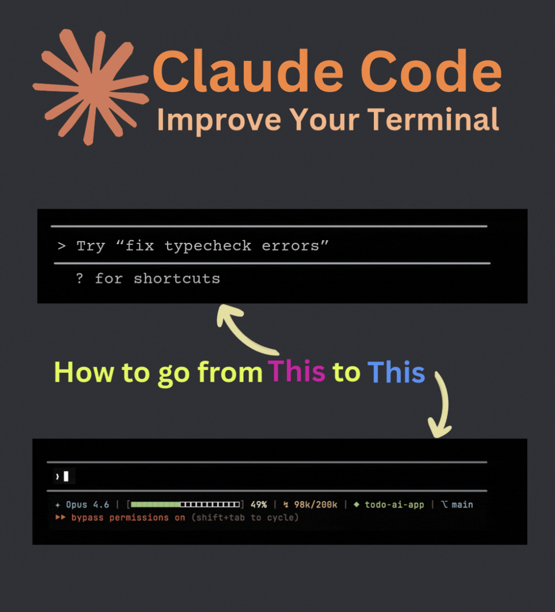

<div align="center">

# Claude Code Terminal Pro

### Upgrade your Claude Code terminal with a rich, informative status line

<br/>



<br/>
<br/>

[](LICENSE)
[]()
[](https://github.com/rathi-prashant/claude-code-terminal-pro/pulls)

</div>

---

## What is this?

By default, Claude Code's terminal shows a minimal prompt. This project replaces it with a **Gruvbox Dark-themed status line** that gives you real-time visibility into:

- **Model name** — which model is currently active (Opus, Sonnet, Haiku, etc.)
- **Context usage progress bar** — 20-segment visual bar showing how much context window is consumed
- **Token count** — exact tokens used vs total context window (e.g. `98k/200k`)
- **Working directory** — current project folder at a glance
- **Git branch** — active branch name, shown automatically when inside a git repo

All of this rendered in a clean **Gruvbox Dark** color palette.

---

## Quick Setup

### Prerequisites

- [Claude Code](https://docs.anthropic.com/en/docs/claude-code) installed and working
- `jq` installed (`brew install jq` on macOS, `apt install jq` on Linux)
- `bc` installed (pre-installed on most systems)

### Step 1: Copy the status line script

```bash
# Create the scripts directory if it doesn't exist
mkdir -p ~/.claude/scripts

# Copy the script
cp scripts/status-line.sh ~/.claude/scripts/status-line.sh

# Make it executable
chmod +x ~/.claude/scripts/status-line.sh
```

Or download it directly:

```bash
mkdir -p ~/.claude/scripts
curl -o ~/.claude/scripts/status-line.sh \
  https://raw.githubusercontent.com/rathi-prashant/claude-code-terminal-pro/main/scripts/status-line.sh
chmod +x ~/.claude/scripts/status-line.sh
```

### Step 2: Update your Claude Code settings

Open your Claude Code settings file at `~/.claude/settings.json` and add the `statusLine` configuration:

```json
{
  "statusLine": {
    "type": "command",
    "command": "~/.claude/scripts/status-line.sh"
  }
}
```

> **Note:** If you already have a `settings.json` with other configurations, just merge the `statusLine` block into your existing file.

### Step 3: Restart Claude Code

Close and reopen Claude Code. Your new status line will appear at the bottom of the terminal.

---

## What the status line shows

```
✦ Opus 4.6 | [■■■■■■■■■■□□□□□□□□□□] 49% | ↯ 98k/200k | ◆ my-project | ⎇ main
```

| Segment | Description |
|:---|:---|
| `✦ Opus 4.6` | Active model name |
| `[■■■■■■■■■■□□□□□□□□□□]` | 20-segment context usage progress bar |
| `49%` | Percentage of context window used |
| `↯ 98k/200k` | Tokens consumed / total context window |
| `◆ my-project` | Current working directory |
| `⎇ main` | Current git branch |

---

## Color Palette (Gruvbox Dark)

| Element | Color | Hex |
|:---|:---|:---|
| Model name | Bright Teal | `#56B6C2` |
| Filled bar | Gruvbox Aqua | `#8EC07C` |
| Empty bar | Near-background | `#32302F` |
| Percentage | Bright foreground | `#FBF1C7` |
| Token count | Warm yellow | `#E0AF68` |
| Directory | Soft green | `#98C379` |
| Git branch | Soft blue | `#8FAFD1` |
| Brackets | Gruvbox gray | `#665C54` |

---

## Customization

### Change the progress bar style

In `scripts/status-line.sh`, you can swap the bar glyphs (around line 50):

```bash
# Option 1: ■□ (large squares) — current default
# Option 2: ▰▱ (horizontal rectangles) — clean, proportional
# Option 3: ━─ (box drawing lines) — minimal, lightweight
```

### Change colors

Edit the color variables at the top of the script. Colors use ANSI 24-bit true color format:

```bash
MODEL_COLOR="\033[38;2;R;G;Bm"  # Replace R, G, B with your values
```

### Change number of segments

Adjust `num_segments` and `segment_size` to control the bar width.

---

## File Structure

```
claude-code-terminal-pro/
├── README.md
├── LICENSE
├── settings.example.json        # Example settings.json snippet
├── scripts/
│   └── status-line.sh           # The status line script
└── images/
    └── claude-code-terminal-before-after.png
```

---

## Troubleshooting

| Issue | Solution |
|:---|:---|
| Status line not appearing | Ensure `statusLine` is in `~/.claude/settings.json` and restart Claude Code |
| `jq: command not found` | Install jq: `brew install jq` (macOS) or `apt install jq` (Linux) |
| `bc: command not found` | Install bc: `apt install bc` (Linux) — pre-installed on macOS |
| Script permission denied | Run `chmod +x ~/.claude/scripts/status-line.sh` |
| Colors look wrong | Ensure your terminal supports 24-bit true color (iTerm2, Alacritty, Kitty, etc.) |

---

## Contributing

Contributions are welcome! If you have ideas for new status line segments, color themes, or improvements:

1. Fork the repo
2. Create your feature branch (`git checkout -b feat/my-feature`)
3. Commit your changes (`git commit -m 'feat: add new feature'`)
4. Push to the branch (`git push origin feat/my-feature`)
5. Open a Pull Request

---

## License

This project is licensed under the MIT License — see the [LICENSE](LICENSE) file for details.

